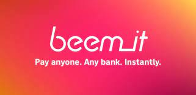

# A Case Study: Beem It, A Digital Wallet

## Overview

'beem_it' is a mobile payment app that lets people to split a payment of a single invoice. The app was built with a simple idea of peer-to-peer payments. The app is free to install and requires everyone who intends to use the features be registered with the app. 

Beem It was founded in 2017 by three big banks ( CBA, NAB and Westpac) and is backed by Australian payments provider, eftpos and by over a dozen Australian banks. Beem It was purchased by eftpos in 2020. [Mark Britt is appointed as a CEO of Beem It in 2021](https://www.eftposaustralia.com.au/news/new-beem-it-ceo-kicks-plan-national-aussie-rewards-program-0).

## Business Activities:

### Pay, request, transfer & split money instantly

The Beem It app allows split [payments](https://www.beemit.com.au/) for end users and/or receive payments by businesses instantaneously regardless of the bank.

### BPAY

[BPAY](https://www.beemit.com.au/bpay) integration with Beem It app helps consumers to schedule payments or split a bill.

### Gift Cards

Beem It allows users to send [giftcards](https://www.beemit.com.au/giftcards) to anyone with gift unwrapping experience to the recipients.

Beem It also has features to store loyalty cards and a range of stickers can be chosen with a payment.

### Groups

The app allows users to form a [group]((https://www.beemit.com.au/split-expenses)) to be able to split the bills otherwise, it is a hassle to manage a bill that needs to be shared among friends.

### Merchants and Businesses

The Beem It app also has features for businesses to integrate [Checkout API's](https://www.beemit.com.au/business/checkout) into their e-commerce sites to enable users to pay for products and services. Beem It integration enables the businesses to give their customers a seamless checkout experience eliminating the hassle of entering card details and thereby potentially reducing abandoned carts.

### Small Businesses

[Small businesses](https://www.beemit.com.au/business) that do not require e-commerce sites can accept payments through their phone with a Beem It app by linking their debit card. This enables them to receive payments instantaneously and eliminating manual payment processing.

### Rewards Program

Beem It has a loyal user base of over 1.5M. Businesses registering for the Rewards program gets access to its user base, insights, gamified social rewards, promotions supporting local businesses among other benefits.

#### Technology

Beem It uses EFTPOS system and works on Visa and Mastercard networks. Beem It requires QR code to receive payments while Osko can work with the POS systems directly. Beem It uses EFTPOS's ConnectID while Osko uses PayID to mask away BSB and account numbers.

## Landscape:

Beem It is a mobile [Digital Wallet](https://www.canstar.com.au/transaction-accounts/beem-it/) with lot more features than its competitors with split payments being the most popular one.

Osko is the closest domestic competetor with most of the features in common. However, its split payments, loyalty program and request money features may be of some interesting features to note.

In late 2021 EFTPOS, BPAY and NPPA had plans to amalgamate to work towards building next generation digital payments platform. The new platform is slated to use [Beem It's QR code system to replace POS systems](https://www.zdnet.com/article/accc-gives-green-light-to-eftpos-merger-with-bpay-and-nppa/). The new entity is called as Australian Payments Plus (AP+)

GPay and Apple Pay are the global bigtech competitors that offers similar features as Osko while using built-in NFC in their phones to store bank cards.

## Results

Although Beem It requires a separate app install unlike Osko which is integrated within the bank app, split payments and loyalty programs are of some interest to many loyal customers.

AP+ enables Beem It's features to get to the next level. AP+ has decided to use Beem It's QR code system to be used for payments processing nationally.

## Recommendations

Crypto currencies are widely accepted as financial assets and therefore, the next logical step for AP+ is to enable Beem It to evolve as a single digital wallet to link a consumers' bank and crypto addresses. This enables Beem It as an All-In-One wallet for consumers.

While industry standard QR code payment processing is a big blow to the BigTech's who control the built-in NFC chips, Crypto wallets would boost the usage of Beem It even further.